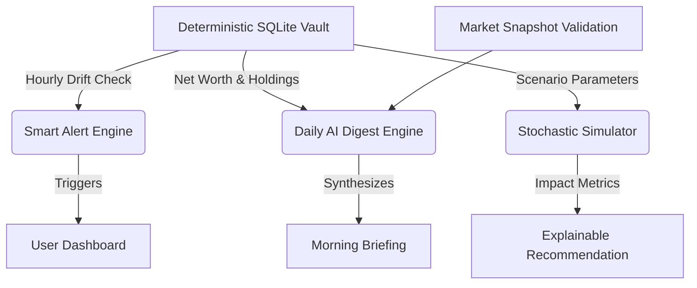

# Nexus AI: Proactive Financial Intelligence

An explainable, macro-aware, and anticipatory financial operating system built for institutional-grade reliability.

## 1. Product Thesis
Nexus AI operates on a singular thesis: **The future of financial AI is not reactive chatbots; it is proactive, habit-forming intelligence grounded in trust engineering.** 

We do not predict stock prices. We translate quantitative macroeconomic complexity, longitudinal portfolio memory, and specific investor goals into human-readable, auditable strategies.

## 2. Problem Statement
Retail investors and portfolio managers distrust black-box financial AI. Current implementations suffer from:
* **Opacity:** Generating static allocations with zero visibility into *why*.
* **Reactivity:** Waiting for user prompts instead of actively monitoring portfolio drift.
* **Repetition:** Nagging users with the same static advice, losing perceived intelligence over time.
* **Speculative Hallucinations:** Inventing financial "facts" to justify random outputs.

## 3. Architecture Overview
Nexus AI completely decouples mathematical portfolio tracking from LLM reasoning. The AI does not compute P&L or allocations. It translates the deterministic output into proactive strategy.



## 4. Trust Engineering Framework
To bridge the gap between "prototype" and "institutional-grade", we implemented explicit Trust Mechanics:
1. **Confidence Scoring:** Every AI recommendation explicitly states its confidence score.
2. **Deterministic vs. Probabilistic:** Hard math (P&L, Net Worth, Scenario math) is fully deterministic and computed in Python. The LLM only provides qualitative analysis (Probabilistic).
3. **Data Freshness Visibility:** The UI explicitly states when the portfolio was last synced and whether the system is operating in a degraded/offline state.
4. **Recommendation Memory:** The `advice_router` fetches historical advice and forces the LLM to either escalate urgency or find a new angle, preventing robotic repetition.

## 5. Key Differentiators (The Moat)
1. **The Daily AI Digest:** Anticipatory synthesis of overnight market regimes and specific holdings.
2. **Smart Alerts:** Proactive tracking of portfolio drift against target `InvestorProfile` weights.
3. **Scenario Simulator:** Transforms the AI from a commentator into a strategic planning assistant (e.g., "What happens if tech rallies 15%?").
4. **Nifty 50 Benchmarking:** Normalizes tracking to answer the user's real question: *"Am I outperforming the market?"*

## 6. System Hardening & Reliability
* **Resilient Scheduling:** Background jobs use `APScheduler` with `tenacity` exponential backoffs and `max_instances=1` to prevent cascading network failures.
* **Schema Enforcement:** Pydantic strictly validates all market data and user inputs (`max_length`, `ge=0`) to prevent injection and malformed data.
* **Rate Limiting:** LLM-heavy endpoints (`/scenario`, `/advice`) are protected via `slowapi` to prevent API exhaustion.
* **Persistent SQLite Volume:** Optimized for execution speed and portability, mounted via Docker.

## 7. Tradeoffs Accepted
| Decision | Primary Benefit | Accepted Cost |
| :--- | :--- | :--- |
| **Vanilla Modular Frontend** | Instant deployment stability, zero-build simplicity. | Less framework scalability than React. |
| **Local Mock Auth** | Accelerated iteration speed for core AI loops. | Requires replacement before public launch. |
| **Deterministic Base** | Maximum explainability, zero hallucinated math. | Less "AI magic" autonomy. |

## 8. Deployment
The system is fully Dockerized for immediate deployment.
```bash
docker-compose up --build -d
```
* **Frontend:** Nginx serving Vanilla HTML/JS (Port 8080)
* **Backend:** FastAPI with SQLite Persistence (Port 8000)

