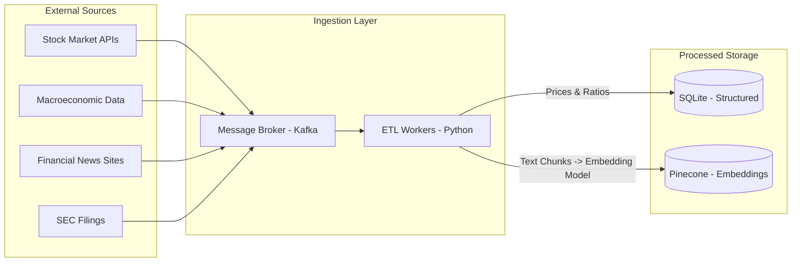
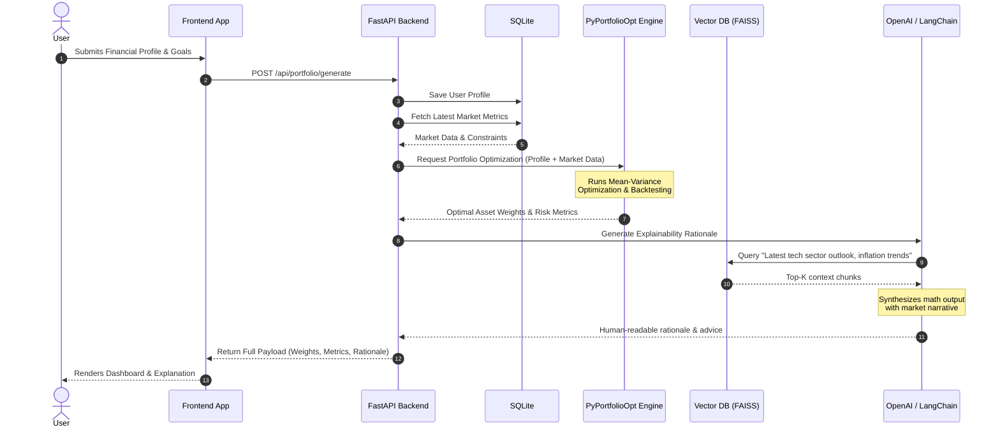

# System Architecture: AI-Powered Investment Advisory Platform

## 1. High-Level Architecture Overview
The platform follows a modular, microservices-oriented architecture to handle data ingestion, financial analytics, AI reasoning, and user interaction seamlessly. It integrates a traditional web backend with an advanced AI and Data Intelligence layer to deliver hyper-personalized investment strategies.

```mermaid
graph TD
    %% Users
    User([Retail Investor])
    
    %% Frontend
    subgraph Frontend [Presentation Layer]
        UI[Vanilla JS (SPA) / React Web App]
        Dash[Power BI / Plotly Dashboards]
    end
    
    %% API Gateway
    Gateway[FastAPI API Gateway]
    
    %% Backend Services
    subgraph Backend [Application Services Layer]
        UserSvc[User & Auth Service]
        PortfolioSvc[Portfolio Service]
        NotifySvc[Notification Service]
    end
    
    %% AI & Analytics
    subgraph AILayer [AI & Analytics Engine]
        Profiler[Investor Profiling Engine]
        Recommender[AI Recommendation Engine - XGBoost]
        Quant[Portfolio Construction - PyPortfolioOpt]
        Rebalancer[Dynamic Rebalancing Module]
    end
    
    %% LLM Layer
    subgraph LLMLayer [Reasoning & Generative Layer]
        Orchestrator[LangChain Orchestrator]
        LLM[OpenAI GPT / Llama]
    end
    
    %% Data Ingestion
    subgraph DataPipeline [Data Intelligence Pipeline]
        MarketData[Market API Aggregator]
        NewsScraper[News & Earnings Scraper]
        Sentiment[Sentiment Analyzer]
    end
    
    %% Databases
    subgraph Storage [Data Storage Layer]
        Relational[(SQLite)]
        Vector[(Pinecone / FAISS)]
        Cache[(Redis Cache)]
    end

    %% Connections
    User -->|HTTP/REST| UI
    UI -->|API Requests| Gateway
    UI -.->|Renders| Dash
    
    Gateway --> UserSvc
    Gateway --> PortfolioSvc
    Gateway --> Orchestrator
    
    UserSvc --> Relational
    PortfolioSvc --> AILayer
    PortfolioSvc --> Relational
    
    DataPipeline --> Relational
    DataPipeline -->|Embeddings| Vector
    
    Profiler --> Recommender
    Recommender --> Quant
    Quant --> Rebalancer
    
    Orchestrator --> LLM
    Orchestrator -->|RAG Queries| Vector
    Orchestrator --> PortfolioSvc
```

---

## 2. Component Layers & Deep Dive

### 2.1. Presentation Layer (Frontend)
**Technologies:** React.js / Vanilla JS (SPA), TailwindCSS, Plotly.js
**Responsibilities:**
* **Client Interface:** Responsive web app where users input financial profiles, risk appetites, and goals.
* **Interactive Dashboards:** Utilizes **Plotly** to render complex financial visualizations, including asset allocation pie charts, historical performance line graphs, and risk heatmaps.
* **Conversational Agent UI:** A persistent chat interface allowing real-time dialogue with the AI financial advisor.
* **State Management:** Uses Redux or Zustand for handling complex client-side state related to simulated portfolio adjustments.

### 2.2. Application API Layer (Backend)
**Technologies:** Python, FastAPI, Celery
**Responsibilities:**
* **API Gateway & Routing:** Fast, asynchronous routing of frontend requests.
* **User & Portfolio Management:** CRUD operations for user profiles, transaction histories, and portfolio snapshots.
* **Task Queues:** Uses **Celery** and **Redis** for handling long-running background tasks (e.g., Monte Carlo simulations, bulk data fetching).
* **Security & Auth:** JWT-based authentication, rate limiting, and encryption for sensitive financial data.

### 2.3. Data Ingestion & Intelligence Pipeline
**Technologies:** Python, Apache Kafka / RabbitMQ, Pandas
**Responsibilities:**
* **Structured Data:** Continuously pulls metrics (prices, yields, inflation rates) from providers like Bloomberg, Alpha Vantage, or Yahoo Finance.
* **Unstructured Data:** Scrapes financial news, SEC 10-K/10-Q filings, and earnings call transcripts.
* **ETL & Transformation:** Cleans data, normalizes prices, and computes real-time technical indicators (RSI, Moving Averages, MACD).



### 2.4. AI & Financial Analytics Engine (Core Logic)
This layer acts as the quantitative brain, processing profiles and market data to construct mathematically optimal portfolios.
* **Investor Profiling:** Maps categorical inputs (e.g., "Aggressive" risk appetite, Age 24) into quantitative constraints.
* **Recommendation Model:** An **XGBoost** model trained on historical portfolio performance to pre-filter asset classes suitable for the user's macroeconomic environment.
* **Portfolio Construction:** Uses **PyPortfolioOpt** to solve the Mean-Variance Optimization (MVO) problem. It calculates the Efficient Frontier, optimizing for the maximum Sharpe ratio while adhering to user-specific constraints (e.g., max 10% crypto).
* **Scenario Simulator:** Runs historical backtesting and Monte Carlo forecasting to generate expected CAGR and maximum drawdown scenarios.

### 2.5. LLM & Reasoning Layer (RAG Architecture)
**Technologies:** LangChain, LlamaIndex, OpenAI GPT-4 / Llama-3
**Responsibilities:**
* **Retrieval-Augmented Generation (RAG):** When generating reasoning, the system retrieves the top-K most relevant market news or economic reports from the Vector DB.
* **Financial Translation:** The LLM receives the raw mathematical output from PyPortfolioOpt (e.g., `{"AAPL": 0.15, "TLT": 0.40}`) and translates it into a personalized, narrative rationale.
* **Guardrails:** Implements strict prompt engineering and output parsing to prevent the LLM from hallucinating financial figures or offering non-compliant advice.

---

## 3. System Data Flow & Sequence

The following sequence diagram illustrates the step-by-step data flow from the moment a user requests a portfolio to the final AI-generated reasoning.



---

## 4. Continuous Monitoring & Rebalancing

1. **Market Event Trigger:** The Data Pipeline detects a significant market anomaly (e.g., S&P 500 drops 5%, or inflation CPI data beats expectations).
2. **Portfolio Scan:** The **Dynamic Rebalancing Module** runs a background job comparing current market conditions against all active user portfolios.
3. **Drift Detection:** If an asset class allocation drifts beyond its target threshold (e.g., Equities grow to 75% instead of target 60%), a rebalance flag is raised.
4. **LLM Notification:** The LLM generates a personalized notification (e.g., "Tech stocks rallied. To maintain your moderate risk profile, we recommend booking profits and reallocating to bonds.").
5. **User Action:** The notification is pushed to the user via WebSockets or email, prompting them to review and approve the rebalance via the dashboard.

## 5. Security & Compliance Considerations
* **Data Encryption:** All Personal Identifiable Information (PII) and financial records are encrypted at rest (AES-256) and in transit (TLS 1.3).
* **Anonymization for LLMs:** Before sending data to external LLMs (like OpenAI API), the backend sanitizes the payload, replacing user names and exact dollar amounts with percentages or tokens to ensure privacy.
* **Audit Logging:** Every generated portfolio recommendation and rebalancing event is immutably logged in SQLite for compliance auditing and backtesting model performance.
