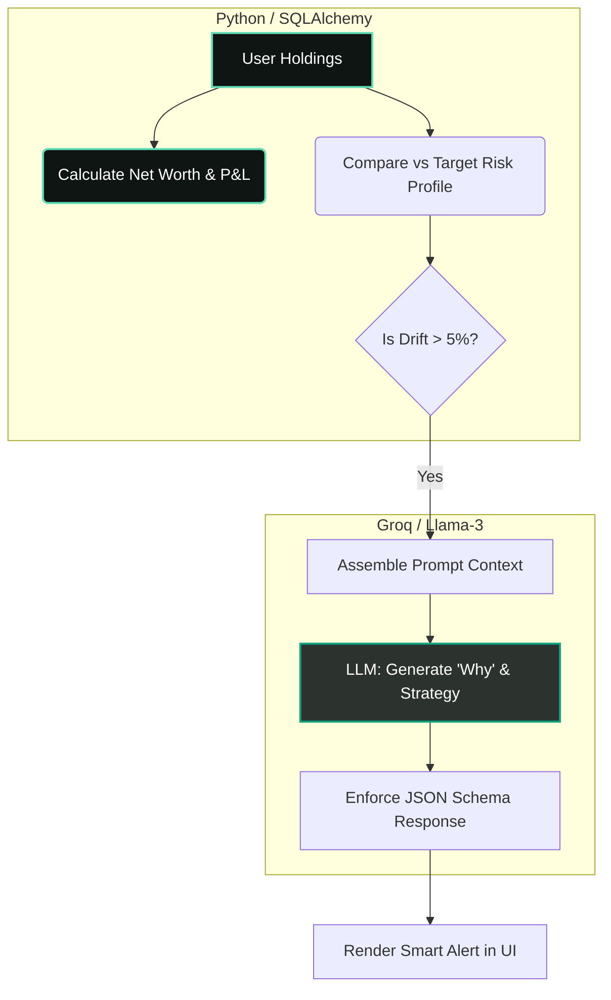
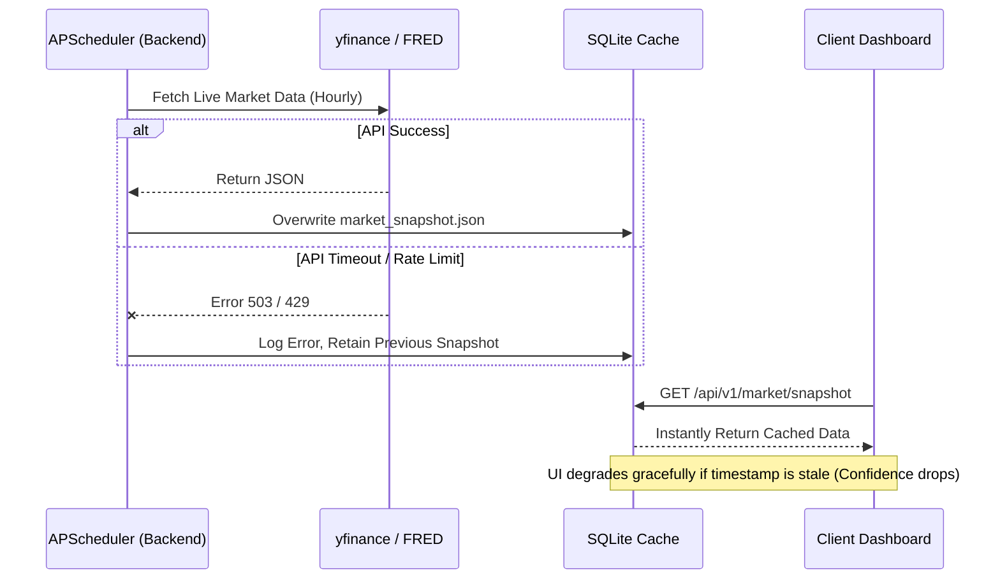
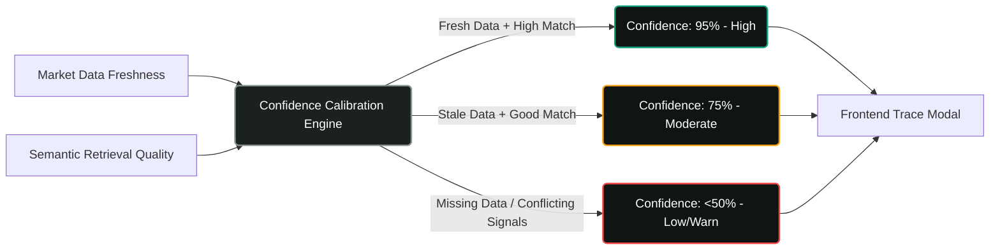
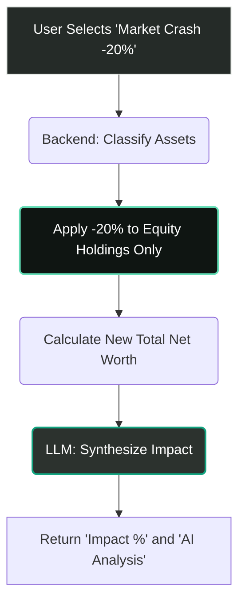

# Nexus AI: Architecture Diagrams

These Mermaid diagrams illustrate the core Trust Engineering and Explainability loops in Nexus AI. They are designed for rendering on GitHub or embedding into presentation decks.

## 1. Deterministic Finance Layer vs. Probabilistic LLM
*This diagram shows how we prevented LLM hallucinations by calculating math in Python before querying the AI.*

## 2. Market Snapshot Flow (Resilience Architecture)
*This demonstrates the "Cache-First" architecture that prevents live API timeouts from breaking the UI.*

## 3. Explainability System & Confidence Calibration
*How the system mathematically assigns "Confidence Scores" to LLM outputs.*

## 4. Scenario Simulator Architecture
*How we process hypotheticals deterministically.*

