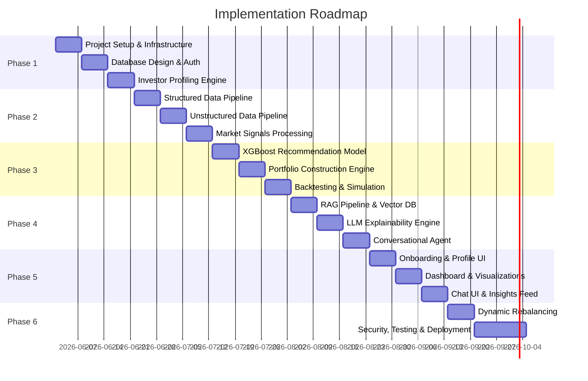

# Phase-Wise Implementation Plan
**AI-Powered Hyper-Personalized Investment Advisory & Portfolio Intelligence Platform**

---

## Phase Overview



---

## Phase 1: Foundation & Core Infrastructure (Weeks 1–3)

**Objective:** Establish the backend skeleton, database layer, authentication, and the Investor Profiling Engine.

### 1.1 Project Initialization & Repository Setup
| Task | Details |
|---|---|
| Initialize Backend | Create FastAPI project with modular folder structure (`/api`, `/services`, `/models`, `/schemas`, `/core`) |
| Initialize Frontend | Scaffold Vanilla JS (SPA) app with App Router, configure Redux/Zustand for state management |
| Monorepo Setup | Configure workspace with shared linting (ESLint, Ruff), formatting (Prettier, Black), and pre-commit hooks |
| Environment Config | Set up `.env` management for API keys, DB credentials, and LLM tokens |
| Docker Compose | Create `docker-compose.yml` with services: `fastapi`, `postgres`, `redis`, `frontend` |
| CI/CD Skeleton | GitHub Actions pipeline for lint, test, and build on every PR |

### 1.2 Database Design (SQLite)
Design and implement the following relational schemas:

**`users` Table**
| Column | Type | Description |
|---|---|---|
| id | UUID (PK) | Unique user identifier |
| email | VARCHAR | Login credential |
| password_hash | VARCHAR | Bcrypt hashed password |
| created_at | TIMESTAMP | Account creation time |

**`investor_profiles` Table**
| Column | Type | Description |
|---|---|---|
| user_id | UUID (FK) | Reference to users |
| age | INT | User's age |
| occupation | VARCHAR | Job title |
| country | VARCHAR | Country of residence |
| tax_bracket | VARCHAR | Tax slab |
| monthly_income | DECIMAL | Gross monthly income |
| monthly_expenses | DECIMAL | Average monthly spend |
| emergency_savings | DECIMAL | Liquid emergency fund |
| existing_investments | JSONB | Breakdown of current holdings |
| debt_obligations | DECIMAL | Total outstanding debt |
| net_worth | DECIMAL | Calculated net worth |
| monthly_investment_amount | DECIMAL | Amount available for investing |
| lump_sum_capability | DECIMAL | One-time investment capacity |
| preferred_sectors | TEXT[] | Sector preferences array |
| ethical_investing | BOOLEAN | ESG preference flag |
| domestic_vs_international | VARCHAR | Geographic preference |
| financial_goals | TEXT[] | Array of goals (retirement, FIRE, etc.) |
| risk_appetite | ENUM | Conservative / Moderate / Aggressive / Very Aggressive |
| investment_horizon | ENUM | Short-term / Medium-term / Long-term |

**`portfolios` Table** — Stores generated portfolio snapshots.
**`portfolio_assets` Table** — Individual asset allocations per portfolio.
**`audit_logs` Table** — Immutable log of every recommendation and rebalance event.

### 1.3 Authentication & Security Layer
| Task | Details |
|---|---|
| JWT Auth | Implement access + refresh token flow with `python-jose` |
| Password Hashing | Use Bcrypt via `passlib` |
| Rate Limiting | Apply `slowapi` middleware to protect endpoints |
| CORS Config | Whitelist frontend origins |
| Input Validation | Use Pydantic schemas for all request/response models |

### 1.4 Investor Profiling Engine (API)
| Endpoint | Method | Description |
|---|---|---|
| `/api/v1/auth/register` | POST | User registration |
| `/api/v1/auth/login` | POST | Returns JWT tokens |
| `/api/v1/profile` | POST | Create investor profile (all fields from table above) |
| `/api/v1/profile` | GET | Retrieve current user profile |
| `/api/v1/profile` | PUT | Update profile (e.g., goal change, income update) |
| `/api/v1/profile/risk-score` | GET | Returns computed quantitative risk score from categorical inputs |

**Risk Score Quantification Logic:**
Map categorical inputs into a numerical risk score (0–100) using weighted factors:
- Age weight: younger → higher score
- Income-to-debt ratio: higher → higher score
- Investment horizon: longer → higher score
- Explicit risk appetite: direct mapping (Conservative=20, Moderate=50, Aggressive=80, Very Aggressive=95)

### Phase 1 Deliverables Checklist
- [x] FastAPI + Vanilla JS (SPA) repos initialized with Docker
- [x] SQLite database schema auto-created on startup
- [x] JWT auth working end-to-end
- [x] Full CRUD for investor profiles
- [x] Risk score calculation endpoint functional
- [x] Unit tests for auth and profile services

---

## Phase 2: Data Intelligence & Market Pipeline (Weeks 4–6)

**Objective:** Build the automated data ingestion system for structured financial metrics, unstructured text, and real-time market signal computation.

### 2.1 Structured Data Ingestion

**Data Sources & APIs:**
| Data Type | Source | Frequency |
|---|---|---|
| Historical Stock Prices | Yahoo Finance (`yfinance`) / Alpha Vantage | Daily |
| Mutual Fund NAVs | AMFI API / Morningstar | Daily |
| ETF Performance | Alpha Vantage / Yahoo Finance | Daily |
| Bond Yields | FRED API (Federal Reserve) | Weekly |
| Gold Prices | GoldAPI / Yahoo Finance | Daily |
| Crypto Data | CoinGecko / Binance API | Hourly |
| Sector Indices | NSE/BSE APIs / Yahoo Finance | Daily |
| Economic Indicators (CPI, GDP, Interest Rates) | FRED API / World Bank API | Monthly |

**Database Tables:**
- `market_prices` — OHLCV data per ticker per day
- `economic_indicators` — Time-series macro data
- `asset_metadata` — Static info (ticker, name, sector, asset class, exchange)

**Implementation:**
- Celery beat scheduler triggers daily/hourly fetch jobs
- Redis as message broker for Celery task queue
- Data validation and deduplication before insert
- Fallback logic: if primary API fails, retry with secondary source

### 2.2 Unstructured Data Ingestion

| Data Type | Source | Method |
|---|---|---|
| Financial News | NewsAPI, Google News RSS, Reuters | REST API + RSS parsing |
| Earnings Call Transcripts | Seeking Alpha, SEC EDGAR | Web scraping (BeautifulSoup) |
| Analyst Reports | Morningstar, broker feeds | API integration |
| Social Sentiment | Twitter/X API, Reddit (PRAW) | Streaming API |
| Central Bank Announcements | RBI, Fed websites | RSS + scheduled scraping |

**Processing Pipeline:**
1. Raw text → Cleaned text (remove HTML, normalize whitespace)
2. Text chunking (512-token overlapping chunks for embedding)
3. Generate embeddings using `sentence-transformers` or OpenAI `text-embedding-3-small`
4. Store chunks + embeddings in **Pinecone / FAISS** vector database
5. Store raw article metadata (title, source, date, URL) in SQLite `news_articles` table

### 2.3 Real-Time Market Signals Computation

Implement a **Technical Indicators Service** using Pandas/NumPy:

| Indicator | Formula/Library | Purpose |
|---|---|---|
| RSI (14-day) | `pandas_ta` | Overbought/oversold detection |
| SMA (50, 200-day) | Pandas rolling mean | Trend identification |
| EMA (12, 26-day) | Pandas ewm | Short-term momentum |
| MACD | EMA(12) - EMA(26) | Trend reversal signals |
| Bollinger Bands | SMA ± 2σ | Volatility measurement |
| Fear & Greed Index | Composite score | Market sentiment gauge |
| Volatility (30-day) | Rolling std deviation of returns | Risk assessment |
| Beta | Covariance with benchmark / Variance of benchmark | Systematic risk |
| Sharpe Ratio | (Return - Rf) / σ | Risk-adjusted return |
| Max Drawdown | Peak-to-trough decline | Worst-case loss |

**Storage:** Computed indicators stored in `market_signals` table, refreshed daily via Celery tasks.

### 2.4 Sentiment Analysis Module
- Use a fine-tuned `FinBERT` model to classify financial text as Bullish / Bearish / Neutral
- Aggregate sentiment scores per sector and per ticker daily
- Store in `sentiment_scores` table with timestamp, source, ticker, and score

### Phase 2 Deliverables Checklist
- [ ] Celery + Redis task queue operational
- [ ] Daily structured data fetch for stocks, bonds, gold, crypto, ETFs
- [x] Unstructured data scrapers functional
- [x] Vector DB (FAISS/Pinecone) populated with text embeddings
- [ ] Technical indicators computed and stored daily
- [ ] FinBERT sentiment scoring pipeline running
- [ ] Integration tests for all data pipelines

---

## Phase 3: AI & Quantitative Analytics Engine (Weeks 7–9)

**Objective:** Build the core intelligence: the ML-based recommendation model, the mathematical portfolio optimizer, and the backtesting/simulation engine.

### 3.1 AI Recommendation Engine (XGBoost)

**Purpose:** Pre-filter which asset classes and sectors are suitable for a given user + market environment.

**Training Data Construction:**
- Features: user risk score, age bucket, income bracket, investment horizon, current market regime (bull/bear/sideways), sector momentum scores, inflation level, interest rate direction
- Labels: historically successful asset class allocations (derived from benchmark portfolios and financial advisor heuristics)

**Model Pipeline:**
1. Feature engineering from `investor_profiles` + `market_signals` tables
2. Train XGBoost classifier to predict top-N asset classes
3. Hyperparameter tuning via Optuna/GridSearchCV
4. Model versioning with MLflow
5. Expose via internal service: `RecommendationService.get_asset_classes(profile, market_state) → List[AssetClass]`

### 3.2 Portfolio Construction Engine (PyPortfolioOpt)

**Purpose:** Given filtered asset classes, compute mathematically optimal weights.

**Optimization Strategies:**
| Strategy | Method | Use Case |
|---|---|---|
| Max Sharpe Ratio | `EfficientFrontier.max_sharpe()` | Aggressive users seeking best risk-adjusted return |
| Min Volatility | `EfficientFrontier.min_volatility()` | Conservative users prioritizing capital preservation |
| Risk Parity | `HRPOpt` (Hierarchical Risk Parity) | Balanced diversification without correlation assumptions |
| Custom Constraints | Sector caps, asset floor/ceiling | Ethical investing, geographic preferences |

**Implementation:**
```
Input:  filtered_tickers, expected_returns, covariance_matrix, user_constraints
Output: { "AAPL": 0.15, "TLT": 0.30, "GLD": 0.10, ... }, risk_metrics
```

- Pull historical price data from `market_prices` table
- Compute expected returns using CAPM or mean historical returns
- Compute sample covariance matrix (with Ledoit-Wolf shrinkage)
- Apply user constraints: `{"max_crypto": 0.10, "min_bonds": 0.20}` derived from risk profile
- Output: optimal weights + portfolio expected return, volatility, Sharpe, max drawdown

**API Endpoint:**
| Endpoint | Method | Description |
|---|---|---|
| `/api/v1/portfolio/generate` | POST | Accepts user_id, runs full pipeline, returns optimized portfolio |
| `/api/v1/portfolio/history` | GET | Returns all past portfolio snapshots for the user |

### 3.3 Backtesting & Scenario Simulation Engine

**Backtesting Module:**
- Simulate the generated portfolio over the last 1, 3, 5, 10 years of historical data
- Calculate: realized CAGR, max drawdown, Sharpe ratio, Sortino ratio, Calmar ratio
- Compare against benchmarks (S&P 500, Nifty 50, 60/40 portfolio)

**Monte Carlo Simulation:**
- Run 10,000 simulated return paths over the user's investment horizon
- Output: probability distribution of terminal wealth, P10/P50/P90 outcomes
- Answer questions like "What is the probability I reach ₹1 Cr in 15 years?"

**Scenario Simulator:**
| Scenario | Implementation |
|---|---|
| Market Crash (-30%) | Apply shock to equity holdings, recompute portfolio value |
| Inflation Spike (+3%) | Adjust bond returns downward, increase gold allocation weight |
| SIP Increase (+₹5,000/mo) | Rerun Monte Carlo with higher monthly contribution |
| Early Retirement (age 45) | Shorten horizon, recalculate required CAGR |

**API Endpoint:**
| Endpoint | Method | Description |
|---|---|---|
| `/api/v1/portfolio/backtest` | POST | Returns historical performance metrics |
| `/api/v1/portfolio/simulate` | POST | Runs Monte Carlo, returns probability distributions |
| `/api/v1/portfolio/scenario` | POST | Applies a specific scenario and returns impact analysis |

### Phase 3 Deliverables Checklist
- [ ] XGBoost model trained, versioned, and serving predictions
- [x] PyPortfolioOpt integration with all optimization strategies
- [ ] Backtesting module validated against benchmark returns
- [ ] Monte Carlo simulation producing P10/P50/P90 outcomes
- [ ] Scenario simulator handling crash, inflation, SIP, and retirement scenarios
- [x] Full portfolio generation pipeline working end-to-end via API
- [ ] Unit + integration tests for all quantitative modules

---

## Phase 4: LLM Reasoning & Conversational Layer (Weeks 10–12)

**Objective:** Integrate LLMs with RAG to generate explainable recommendations, power the conversational advisor, and deliver financial education.

### 4.1 Vector Database & RAG Pipeline

**Embedding Pipeline (already seeded in Phase 2):**
- Documents: news articles, SEC filings, earnings transcripts, economic reports
- Embedding model: `text-embedding-3-small` (OpenAI) or `all-MiniLM-L6-v2` (local)
- Vector store: FAISS (local dev) / Pinecone (production)
- Metadata filters: date range, source type, sector, ticker

**Retrieval Strategy:**
1. User asks a question or a portfolio is generated
2. System constructs a semantic query (e.g., "tech sector outlook Q2 2026 inflation impact")
3. Retrieve top-K (K=5) relevant document chunks from vector DB
4. Inject retrieved context into the LLM prompt as grounding material

### 4.2 LLM Explainability Engine

**Purpose:** Translate raw PyPortfolioOpt output into human-readable financial narratives.

**Prompt Template Structure:**
```
SYSTEM: You are a certified financial advisor. Explain investment decisions clearly.
Never hallucinate numbers. Only use the provided data.

CONTEXT (from RAG): {retrieved_market_context}

USER PROFILE: Age: {age}, Risk: {risk}, Goal: {goal}, Horizon: {horizon}

PORTFOLIO OUTPUT: {json_weights_and_metrics}

TASK: Generate a personalized explanation covering:
1. Why each asset class was chosen
2. How allocations align with the user's risk appetite
3. Key risks to monitor
4. Current market conditions supporting these choices
5. Long-term outlook and expected outcomes
```

**Output Format:**
- Investor Summary section
- Portfolio Allocation table with per-asset reasoning
- AI Insights (3-5 bullet points on market conditions)
- Risk Analysis (volatility, expected CAGR, drawdown risk, diversification score)
- Market Signals Used (which indicators influenced the decision)

### 4.3 Conversational Advisory Agent

**Architecture:** LangChain Agent with tool-calling capabilities.

**Available Tools for the Agent:**
| Tool Name | Function |
|---|---|
| `get_user_profile` | Fetches current investor profile |
| `get_current_portfolio` | Retrieves active portfolio |
| `run_scenario` | Triggers scenario simulation |
| `search_market_news` | RAG query against vector DB |
| `get_market_signals` | Fetches latest technical indicators |
| `calculate_sip_projection` | Computes future value of SIP |

**Example Conversations Supported:**
- "Why did my portfolio change?" → Agent calls `get_current_portfolio` + `search_market_news`
- "Should I invest during a market crash?" → Agent calls `get_market_signals` + RAG search
- "Can I retire by age 45?" → Agent calls `get_user_profile` + `run_scenario`
- "How much should I SIP monthly?" → Agent calls `calculate_sip_projection`

### 4.4 Financial Education Module
- Pre-built prompt chains for explaining: CAGR, inflation, Sharpe ratio, ETFs, SIPs, diversification, risk-adjusted returns, beta, drawdowns
- Triggered when the user asks "What is X?" or the system detects jargon in its own explanation
- Adapts complexity based on user's stated financial literacy level

### 4.5 Guardrails & Compliance
| Guardrail | Implementation |
|---|---|
| No hallucinated numbers | Output parser validates all numbers against source data |
| No specific buy/sell advice | System prompt enforces "educational, not advisory" framing |
| PII anonymization | Strip names, exact amounts before sending to external LLM |
| Token budgeting | Limit context window to prevent cost overruns |
| Fallback responses | If LLM fails or returns invalid output, serve cached template response |

### Phase 4 Deliverables Checklist
- [x] RAG pipeline retrieving context (Live News Feed Ingestion)
- [x] LLM generating personalized portfolio explanations
- [x] Conversational agent handling 4+ query types with tool-calling
- [x] Financial education responses for all key terms
- [x] Guardrails tested (hallucination, PII, compliance)
- [x] Latency optimization: responses under 5 seconds

---

## Phase 5: Frontend Dashboard & Visualization (Weeks 13–15)

**Objective:** Build the user-facing application with onboarding, portfolio dashboard, AI chat, and market intelligence views.

### 5.1 User Onboarding Flow
A multi-step wizard collecting all investor profile data:

| Step | Fields Collected |
|---|---|
| Step 1: Personal Info | Age, occupation, country, tax bracket |
| Step 2: Financials | Monthly income, expenses, savings, debts, net worth |
| Step 3: Investment Preferences | Monthly amount, lump-sum, sectors, ethical/ESG, domestic vs intl |
| Step 4: Goals | Retirement, FIRE, house, education, passive income, tax optimization |
| Step 5: Risk Assessment | Interactive questionnaire → maps to Conservative/Moderate/Aggressive |
| Step 6: Review & Submit | Summary card → triggers portfolio generation |

### 5.2 Portfolio Dashboard (Plotly.js)

| Component | Visualization Type | Data Source |
|---|---|---|
| Asset Allocation | Interactive donut/pie chart | `/api/v1/portfolio/current` |
| Historical Performance | Line chart (portfolio vs benchmarks) | `/api/v1/portfolio/backtest` |
| Risk Heatmap | Color-coded matrix (sector × risk factor) | `/api/v1/portfolio/risk` |
| Net Worth Projection | Fan chart (P10/P50/P90 bands) | `/api/v1/portfolio/simulate` |
| CAGR Projection | Bar chart (by horizon: 1Y, 3Y, 5Y, 10Y) | Computed from backtest |
| Diversification Score | Gauge/radial chart (0–10) | Portfolio metrics |

### 5.3 AI Insights Feed
- Daily/weekly personalized cards showing AI-generated market insights
- Each card contains: headline, 2-3 sentence summary, relevance to user's portfolio, source attribution
- Pull from `/api/v1/insights/daily` endpoint which runs RAG + LLM on latest market data

### 5.4 Conversational Chat Interface
- Persistent chat drawer/panel on the right side of the dashboard
- Real-time streaming responses via WebSocket or Server-Sent Events (SSE)
- Message history stored in SQLite, loaded on session start
- Suggested prompts: "Why this allocation?", "What if markets crash?", "Explain my risk score"

### 5.5 Market Intelligence View
| Component | Description |
|---|---|
| Sector Momentum Table | Ranked sectors with RSI, trend direction, sentiment score |
| Economic Outlook Cards | Inflation, interest rates, GDP growth — with AI commentary |
| Fear & Greed Gauge | Visual indicator of overall market sentiment |

### Phase 5 Deliverables Checklist
- [x] Multi-step onboarding wizard functional
- [x] Portfolio dashboard with interactive Plotly charts
- [x] AI insights feed rendering daily personalized cards
- [x] Chat interface with LLM responses integrated
- [x] Market intelligence view with live TradingView charts
- [x] Fully responsive design (desktop + tablet + mobile)
- [ ] Accessibility audit (WCAG 2.1 AA compliance)

---

## Phase 6: Advanced Features, Testing & Deployment (Weeks 16–20)

**Objective:** Implement dynamic rebalancing, finalize security hardening, conduct comprehensive testing, and deploy to production.

### 6.1 Dynamic Portfolio Rebalancing Module

**Monitoring (Celery Beat Scheduled Jobs):**
| Check | Frequency | Trigger Condition |
|---|---|---|
| Portfolio Drift | Daily | Any asset class deviates >5% from target weight |
| Sector Overheating | Daily | Sector RSI > 70 for 5 consecutive days |
| Market Crash Signal | Hourly | Benchmark drops >5% in a single session |
| Inflation Spike | Weekly | CPI exceeds 2σ above trailing average |
| User Goal Change | On-event | User updates profile goals or risk appetite |

**Rebalancing Workflow:**
1. Trigger detected → Rebalancing Service computes new optimal weights
2. LLM generates personalized notification explaining the recommended change
3. Notification pushed via WebSocket (in-app) + email (SendGrid/SES)
4. User reviews on dashboard → Approves or dismisses
5. If approved, new portfolio snapshot saved; audit log updated

### 6.2 Security Hardening
| Area | Implementation |
|---|---|
| Encryption at Rest | AES-256 for PII columns in SQLite (pgcrypto) |
| Encryption in Transit | TLS 1.3 enforced on all endpoints |
| PII Anonymization | Middleware strips user names/amounts before LLM API calls |
| API Security | OWASP Top 10 review, SQL injection prevention via ORM |
| Secrets Management | HashiCorp Vault or AWS Secrets Manager |
| Audit Trail | Every portfolio generation/rebalance logged immutably |

### 6.3 Testing Strategy
| Test Type | Scope | Tools |
|---|---|---|
| Unit Tests | All services, models, utilities | Pytest, Jest |
| Integration Tests | API → DB → AI pipeline flows | Pytest + httpx |
| Load Testing | API endpoints under 1000 concurrent users | Locust / k6 |
| Security Testing | Penetration testing, dependency scanning | OWASP ZAP, Snyk |
| LLM Output Validation | Verify no hallucination in 100 sample outputs | Custom eval harness |
| Backtest Accuracy | Compare portfolio returns against known benchmarks | Custom validation scripts |
| E2E Tests | Full user journey: register → profile → portfolio → chat | Playwright |

### 6.4 Deployment Architecture
| Component | Deployment |
|---|---|
| FastAPI Backend | Docker container on AWS ECS / GCP Cloud Run |
| Vanilla JS (SPA) Frontend | Vercel or AWS Amplify |
| SQLite | AWS RDS / GCP Cloud SQL (managed) |
| Redis | AWS ElastiCache |
| Pinecone | Managed cloud service |
| Celery Workers | Dedicated ECS tasks with auto-scaling |
| Monitoring | Prometheus + Grafana for metrics; Sentry for error tracking |
| Logging | ELK Stack (Elasticsearch, Logstash, Kibana) |

**CI/CD Pipeline (GitHub Actions):**
1. PR opened → Lint + Unit Tests + Security Scan
2. PR merged to `main` → Build Docker images → Push to ECR
3. Staging deploy → Run integration + E2E tests
4. Manual approval → Production deploy (blue-green)

### Phase 6 Deliverables Checklist
- [ ] Dynamic rebalancing module with 5 trigger types operational
- [ ] Push notifications (in-app + email) working
- [ ] All security measures implemented and audited
- [ ] >80% unit test coverage across backend
- [ ] Load tested to handle 1000 concurrent users
- [ ] LLM output validation passing on 100 samples
- [ ] E2E tests covering full user journey
- [ ] Production deployment on cloud infrastructure
- [ ] Monitoring dashboards (Grafana) and error tracking (Sentry) active
- [ ] Documentation: API docs (Swagger), user guide, and runbook

---

## Success Criteria Summary

| Metric | Target |
|---|---|
| Personalization Accuracy | Portfolio matches risk profile in >95% of cases |
| Diversification Score | Average score >7.5/10 across all generated portfolios |
| AI Explainability | >90% of users rate explanations as "clear" or "very clear" |
| Conversational Accuracy | Agent answers >85% of financial queries correctly |
| Dashboard Usability | System Usability Scale (SUS) score >80 |
| API Latency (P95) | Portfolio generation <3s, Chat response <5s |
| Rebalancing Precision | Drift detected and alerted within 24 hours |
| Uptime | 99.9% availability SLA |

---

## Final Outcome

A production-ready, AI-native digital wealth advisor that:
- **Thinks** like a portfolio manager (MPT, Efficient Frontier, risk optimization)
- **Explains** like a financial advisor (LLM-powered narratives with RAG grounding)
- **Adapts** like a hedge fund analyst (real-time market signals, dynamic rebalancing)
- **Educates** like a finance mentor (conversational AI simplifying complex concepts)
- **Personalizes** like a modern AI assistant (deep profiling, goal-aware, life-stage-aware)

Making intelligent investing accessible to everyday users.
